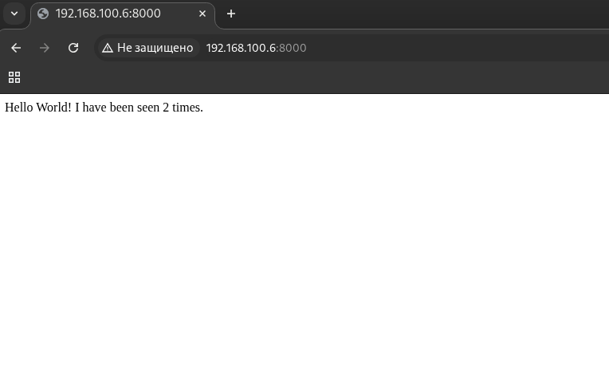

Задание:
Создать два стека многоконтейнерных приложений:

Flask+redis – веб-приложение со счетчиком входов;

Prometheus+grafana – сервер мониторинга.

Необходимо настроить сбор метрик с приложения на систему мониторинга.

Все исходники загрузить в репо на гитхаб, в качестве ответа прикрепить ссылку.

Установка необходимых пакетов
```bash
sudo apt -y update && sudo apt -y install docker-compose-v2
```


Структура web прилолжения
```bash
├── app.py
├── compose.yml
├── dockerfile
└── requirements.txt
```

Исходный код приложения  (app.py)
```python
import time 
import redis 
from flask import 
Flask app = Flask(__name__) 
cache = redis.Redis(host='redis', port=6379)
def get_hit_count(): 
	return cache.incr('hits') 

@app.route('/') 
def hello(): 
	count = get_hit_count() 
	return 'Hello World! I have been seen {} times.\n'.format(count)
```

Объявляем зависимости для python (requirements.txt)
```txt
redis
flask
```


Dockerfile для контейнера с flask (dockerfile)
```dockerfile
# syntax=docker/dockerfile:1 
FROM python:3.10-alpine 
WORKDIR /code 
ENV FLASK_APP=app.py 
ENV FLASK_RUN_HOST=0.0.0.0 
RUN apk add --no-cache gcc musl-dev linux-headers 
COPY requirements.txt requirements.txt 
RUN pip install -r requirements.txt 
EXPOSE 5000 
COPY app.py . 
CMD ["flask", "run", "--debug"]
```


Создаем (compose.yml) – описание 2х сервис-контейнеров
```yaml
---
services:
  web:
    build: .
    ports:
      - "8000:5000"
  redis:
    image: "redis:alpine"
```

Запускаем приложение 
```bash
docker compose up -d --build
```


Проверка 
```bash
docker compose ps

NAME              IMAGE          COMMAND                  SERVICE   CREATED         STATUS         PORTS
web_app-redis-1   redis:alpine   "docker-entrypoint.s…"   redis     3 minutes ago   Up 3 minutes   6379/tcp
web_app-web-1     web_app-web    "flask run --debug"      web       3 minutes ago   Up 3 minutes   0.0.0.0:8000->5000/tcp, [::]:8000->5000/tcp

```

```bash
curl 127.0.0.1:8000                                                                                                                                        
Hello World! I have been seen 3 times.
```





Структура мониторинга

```bash
├── compose.yml
├── grafana
│   └── datasource.yml
└── prometheus
    └── prometheus.yml
```

compose.yml для Prometheus+Grafana
```yaml
---
services:
  prometheus:
    image: prom/prometheus
    container_name: prometheus
    command:
      - '--config.file=/etc/prometheus/prometheus.yml'
    ports:
      - 9090:9090
    restart: unless-stopped
    volumes:
      - ./prometheus:/etc/prometheus
      - prom_data:/prometheus
  grafana:
    image: grafana/grafana
    container_name: grafana
    ports:
      - 3000:3000
    restart: unless-stopped
    environment:
      - GF_SECURITY_ADMIN_USER=admin
      - GF_SECURITY_ADMIN_PASSWORD=grafana
    volumes:
      - ./grafana:/etc/grafana/provisioning/datasources
      - grafana_data:/var/lib/grafana
volumes:
  prom_data:
  grafana_data:
  ```

Создаем конфиг для prometheus/prometheus.yml
```yaml
---
  global:
    scrape_interval: 5s
    scrape_timeout: 3s
    evaluation_interval: 15s
  alerting:
    alertmanagers:
    - static_configs:
      - targets: []
      scheme: http
      timeout: 10s
      api_version: v2
  scrape_configs:
  - job_name: prometheus
    honor_timestamps: true
    scrape_interval: 15s
    scrape_timeout: 10s
    metrics_path: /metrics
    scheme: http
    static_configs:
    - targets:
      - localhost:9090
```

Создаем конфиг для
```yaml
---
apiVersion: 1
datasources:
  - name: Prometheus
    type: prometheus
    url: http://prometheus:9090
    isDefault: true
    access: proxy
    editable: true
```

Запускаем приложение 
```bash
docker compose up -d --build
```

Проверяем
```bash
docker compose ps                                                                                                                                                                            
NAME         IMAGE             COMMAND                  SERVICE      CREATED         STATUS         PORTS
grafana      grafana/grafana   "/run.sh"                grafana      7 seconds ago   Up 6 seconds   0.0.0.0:3000->3000/tcp, :::3000->3000/tcp
prometheus   prom/prometheus   "/bin/prometheus --c…"   prometheus   7 seconds ago   Up 6 seconds   0.0.0.0:9090->9090/tcp, :::9090->9090/tcp
```


Проверка мониторинга Prometheus+Grafana
Смотрим метрику самого Prometheus
![[prome.png]]

Добавляем мониторинг нашего Flask-приложения
compose.yml для Prometheus+Grafana+BlackBox
```yaml
---
services:
  prometheus:
    image: prom/prometheus
    container_name: prometheus
    command:
      - '--config.file=/etc/prometheus/prometheus.yml'
    ports:
      - 9090:9090
    restart: unless-stopped
    volumes:
      - ./prometheus:/etc/prometheus
      - prom_data:/prometheus
  grafana:
    image: grafana/grafana
    container_name: grafana
    ports:
      - 3000:3000
    restart: unless-stopped
    environment:
      - GF_SECURITY_ADMIN_USER=admin
      - GF_SECURITY_ADMIN_PASSWORD=grafana
    volumes:
      - ./grafana:/etc/grafana/provisioning/datasources
      - grafana_data:/var/lib/grafana

  blackbox:
    image: prom/blackbox-exporter
    container_name: blackbox
    ports:
      - 9115:9115

volumes:
  prom_data:
  grafana_data:
  ```

Обновляем конфиг prometheus, добавляем в секцию scrape_configs указания кого мониторить через blackbox
```yaml
---
  global:
    scrape_interval: 5s
    scrape_timeout: 3s
    evaluation_interval: 15s
  alerting:
    alertmanagers:
    - static_configs:
      - targets: []
      scheme: http
      timeout: 10s
      api_version: v2
  scrape_configs:
  - job_name: prometheus
    honor_timestamps: true
    scrape_interval: 15s
    scrape_timeout: 10s
    metrics_path: /metrics
    scheme: http
    static_configs:
    - targets:
      - localhost:9090
  - job_name: blackbox-http 
    metrics_path: /probe 
    params: 
      module: [http_2xx] 
    static_configs: 
      - targets: 
        - http://192.168.100.10:8000 # Flask 
        - https://etis.psu.ru 
        - https://student.psu.ru 
    relabel_configs: 
      - source_labels: [__address__] 
        target_label: __param_target 
      - source_labels: [__param_target] 
        target_label: instance 
      - target_label: __address__ 
        replacement: blackbox:9115

```

Пересобираем стек мониторинга Запускаем новую сборку контейнеров мониторинга 
```bash
docker compose build 
docker compose up -d
```

Проверяем через Grafana заодно создаем дашборд 13659
![[dash.png]]


Доп. задание :
Добавить в flask приложение endpoint для нативной выдачи Prometheus метрик 
Добавить в Prometheus сбор этих метри 
Добавить в Grafana график кол-ва посещений сайта в секунду/минуту

Добавляем в приложение endpoint для метрик
Исходный код приложения  (app.py)
```python
import redis 
from flask import Flask, make_response 
import socket 

app = Flask(__name__) 
cache = redis.Redis(host='redis', port=6379) 

def get_hit_count() -> int: 
    return int(cache.get('hits') or 0) 

def incr_hit_count() -> int: 
    return cache.incr('hits') 


@app.route('/metrics') 
def metrics(): 
    metrics = f''' 
# HELP view_count Flask-Redis-App visit counter 
# TYPE view_count counter 
view_count{{service="Flask-Redis-App"}} {get_hit_count()} 
''' # sic double quotes in label 
    response = make_response(metrics, 200) 
    response.mimetype = "text/plain" 
    return response 


@app.route('/') 
def hello(): 
    incr_hit_count() 
    count = get_hit_count() 
    return 'Hello World! I have been seen {} times. My name is: {}\n'.format(count, socket.gethostname())

```


Пересобираем контейнер, проверяем метрики
```bash
docker compose -f web_app/compose.yml down 
docker compose -f web_app/compose.yml up -d --build
```
Проверяем через curl
```bash
curl 127.0.0.1:8000/metrics                                                                                                                              
 
    # HELP view_count Flask-Redis-App visit counter 
    # TYPE view_count counter 
    view_count{service="Flask-Redis-App"} 7
```

Добавляем цель в prometheus.yaml

```yaml
---
  global:
    scrape_interval: 5s
    scrape_timeout: 3s
    evaluation_interval: 15s
  alerting:
    alertmanagers:
    - static_configs:
      - targets: []
      scheme: http
      timeout: 10s
      api_version: v2
  scrape_configs:
  - job_name: prometheus
    honor_timestamps: true
    scrape_interval: 15s
    scrape_timeout: 10s
    metrics_path: /metrics
    scheme: http
    static_configs:
    - targets:
      - localhost:9090

  - job_name: view_total 
    metrics_path: /metrics 
    scrape_interval: 15s 
    scrape_timeout: 10s 
    static_configs: 
    - targets: [ '192.168.100.10:8000' ] 
      labels: 
        service: 'Flask-Redis-App'

  - job_name: blackbox-http 
    metrics_path: /probe 
    params: 
      module: [http_2xx] 
    static_configs: 
      - targets: 
        - http://192.168.100.10:8000 # Flask 
        - https://reg.ru 
        - https://student.psu.ru 
    relabel_configs: 
      - source_labels: [__address__] 
        target_label: __param_target 
      - source_labels: [__param_target] 
        target_label: instance 
      - target_label: __address__ 
        replacement: blackbox:9115

```

Перезапускаем контейнер с прометеусом для перечитывания конфига
```bash
docker exec prometheus killall prometheus
```

Добавляем панель на дашборд в Grafana
![[view_count.png]]
